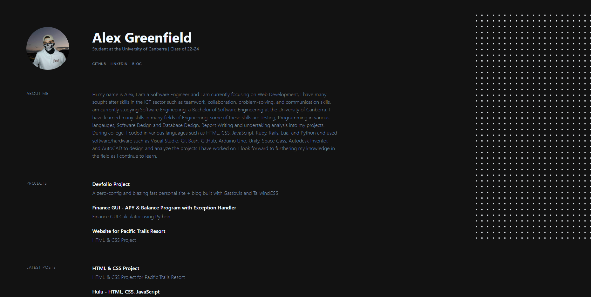

## Devfolio Web Page - TailwindCSS, GatsbyJS.




This blog post goes into some detail on the Github Project website, Devfolio. It was built using TailwindCSS and GatsbyJS. It is a personal portfolio website that you can find developers social media, projects, experience, blog posts and relevant skills. This can be used as a mode of collating your best projects and putting them on display so other developers and recruiters can access your portfolio in an efficent enviorment, where most of the information they need can be found easily. 


## Devfolio Source Code for Main Webpage

If you are interested, below you can find the source code for this webpage, if you want to have a look at the CSS and JavaScript component of this project you can find the source code for this project in [my Devfolio respository, on Github.](https://github.com/AlexG2G/devolio).


#
```js

module.exports = {
  siteMetadata: {
    // Site URL for when it goes live
    siteUrl: `https://alexgreenfield.netlify.app/`,
    // Your Name
    name: 'Alex Greenfield',
    // Main Site Title
    title: `Alex Greenfield | University of Canberra Software Engineering`,
    // Description that goes under your name in main bio
    description: `Student at the University of Canberra | Class of 2024`,
    // Optional: Github account URL
    github: `https://github.com/AlexG2G`,
    // Optional: LinkedIn account URL
    linkedin: `https://www.linkedin.com/in/alex-greenfield-755142243/`,
    // Content of the About Me section
    about: `Alex is a Software Engineer currently focusing on Web Development and Python Programming.
     He has many sought after skills in the ICT sector such
    as teamwork, collaboration, problem-solving, and communication skills.
    He is currently studying a Bachelor of Software Engineering at the University of Canberra.`,
    
    projects: [
      {
        name: 'Devfolio Project',
        description:
          'A zero-config and blazing fast personal site + blog built with GatsbyJs and TailwindCSS',
        link: 'https://github.com/AlexG2G/website',
      },
      {
        name: 'Finance GUI - APY & Balance Program',
        description:
          'Finance GUI Calculator using Python',
        link: 'https://github.com/AlexG2G/Finance-GUI',
      },
      {
        name: 'Website for Pacific Trails Resort',
        description:
          'HTML & CSS Project',
        link: 'https://github.com/AlexG2G/intro-to-information-technology/tree/main/assignment_5',
      },
    ],
    // Optional: List your experience, they must have `name` and `description`. `link` is optional.
    experience: [
      {
        name: 'University of Canberra',
        description: 'Full-Stack Developer, February 2022 - Present',
        link: 'https://www.linkedin.com/school/university-of-canberra/',

      },
      {
        name: 'University of Canberra',
        description: 'Front End Developer, February 2022 - Present',
        link: 'https://www.linkedin.com/school/university-of-canberra/',
      },
      {
        name: 'University of Canberra',
        description: 'Python Developer, February 2022 - Present',
        link: 'https://www.linkedin.com/school/university-of-canberra/',
      },
    ],
    // Optional: List your skills, they must have `name` and `description`.
    skills: [
      {
        name: 'Languages & Frameworks',
        description:
          'JavaScript (ES6+), Python, Node.js, React, Ruby, HTML, CSS, Git, Lua, Gatsby.js, TailwindCSS',
      },
      {
        name: 'Databases',
        description: 'MongoDB, MySQL',
      },
      {
        name: 'Other',
        description:
          'Docker, Software Design, Database Design, System Design, DBMS, CI / CD, API design, Agile / Scrum, Cyber Security, Bash',
      },
    ],
  },
  plugins: [
    `gatsby-plugin-react-helmet`,
    {
      resolve: `gatsby-source-filesystem`,
      options: {
        name: `images`,
        path: `${__dirname}/src/images`,
      },
    },
    {
      resolve: `gatsby-source-filesystem`,
      options: {
        path: `${__dirname}/content/blog`,
        name: `blog`,
      },
    },
    {
      resolve: `gatsby-transformer-remark`,
      options: {
        plugins: [
          {
            resolve: `gatsby-remark-images`,
            options: {
              maxWidth: 590,
              wrapperStyle: `margin: 0 0 30px;`,
            },
          },
          {
            resolve: `gatsby-remark-responsive-iframe`,
            options: {
              wrapperStyle: `margin-bottom: 1.0725rem`,
            },
          },
          `gatsby-remark-prismjs`,
          `gatsby-remark-copy-linked-files`,
          `gatsby-remark-smartypants`,
        ],
      },
    },
    `gatsby-transformer-sharp`,
    `gatsby-plugin-sharp`,
    `gatsby-plugin-postcss`,
    `gatsby-plugin-feed`,
    {
      resolve: `gatsby-plugin-google-analytics`,
      options: {
        trackingId: `UA-233906999-2`, // Optional Google Analytics
      },
    },
    {
      resolve: `gatsby-plugin-manifest`,
      options: {
        name: `devfolio`,
        short_name: `devfolio`,
        start_url: `/`,
        background_color: `#663399`,
        theme_color: `#663399`, // This color appears on mobile
        display: `minimal-ui`,
        icon: `src/images/icon.png`,
      },
    },
  ],
};

```

Thank you for reading this blog post!

